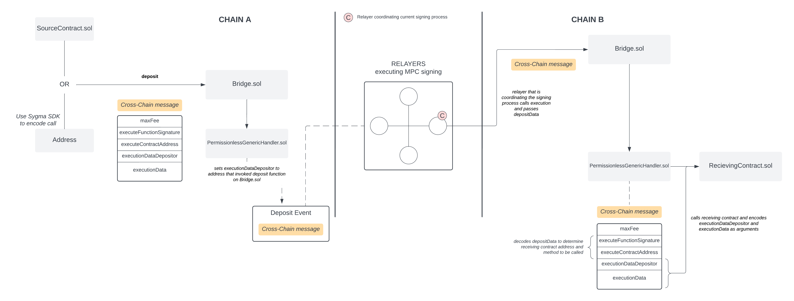
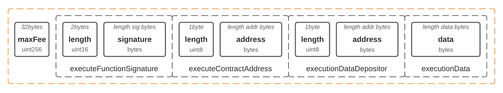

:::info
The following details how Generic message passing is handled by Sygma.
:::

 Sygma allows developers to exchange arbitrary data between networks, we call this Generic Message Passing or GMP. Sygma allows developers to use GMP in permissionless manner and call any smart contract as well as initiate call from any contract. 



**Glossary:**

- **Cross-Chain message**: encoded data passed as an argument on a deposit function call - holds all information on cross-chain call
- **Receiving contract**: a contract that is being called on the destination chain when executing the cross-chain call
- **Receiving function**: function of the **receiving contract** that is called on the destination chain
- **Source contract**: a contract that invoked deposit on source chain (in this case, address contract would be metadata depositor). The deposit function can also be called by a specific user; in this case, there is no source contract, but the user address is a metadata depositor.

## Usage guide

On the source network EOA or contract can call [deposit function](https://github.com/sygmaprotocol/sygma-solidity/blob/master/contracts/Bridge.sol#L235).

When calling deposit on source network, `depositData` is necessary execution information on destination chain and should follow next format:



On the source network Bridge contract sets **msg.sender** as **executionDataDepositor**, hence this allows destination network contract to authorise the call.

The only interface that  developers should follow is the signature of **receiving function** it should always has first param to be an address of metadataDepositor

```solidity
function recieveExecutionFromSygma(bytes32 metadataDepositor, arg2, arg3)
```

## Fees
Currently we support only **BasicFeeHandler** for GMP, which means that you would need to transfer specified amount of base currency along with deposit request. 
 
