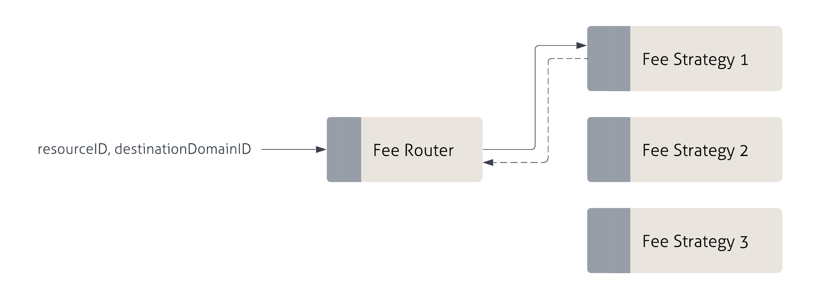

:::info
The following section details how fees are handled by Sygma.
:::

Sygma collects a service fee for two purposes:

1. Cover transaction costs (gas fees) 
2. Protocol revenues

While gas fees are required to execute transactions on the destination chains, protocol revenues guarantee that Sygma can sustain the operational costs of a public utility and remain contributor-owned.

### Fee Strategies

The protocol gives developers granular control over the handling of fees for any resource (ERC-20, ERC-721, GMP) that can be bridged from one network to another. Even though the specific implementation of fees will differ based on chain architecture (e.g. EVM or Substrate), general functionality of fees will work the same across implementations. 

Each resource is assigned a **fee strategy** for every potential destination network (i.e. domain), where the mapping between the fee strategy and the domain outlines all potential bridging routes for a given resource. The fee strategy defines the set of rules on how fees should be charged when executing deposits on the source chain. 

The Sygma protocol allows for two fee strategies, implemented via **fee handlers** (contracts in EVM, pallets in Substrate):
- [**Fixed fee strategy**](02-Fixed-Fee.md)
- [**Dynamic fee strategy**](03-dynamic-fee.md)

### Fee Collection

Fees are usually collected in the source (i.e. native) token, but can be collected in any token provided a [dynamic fee strategy](/docs/03-architecture/03-Fees/03-dynamic-fee.md) is selected. If you are interested in a custom fee setup, please contact us on [Discord](https://discord.gg/Qdf6GyNB5J) or fill out [this form](https://share.hsforms.com/1K4-T_yaKSp6F06FGk4wsSgnmy2x).