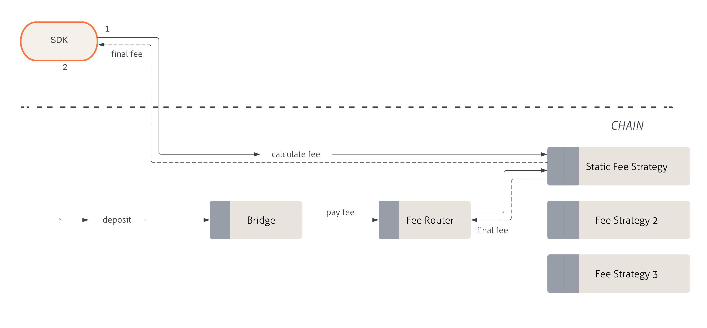

:::info
The following section details how fixed fee strategies work in Sygma.
:::

The fixed fee strategy requires a predefined fixed fee amount per deposit. It can only collect fees in the native currency (e.g. ETH, MATIC) of the source chain.

The diagram below shows the flow for fixed fee strategies, beginning with the Sygma SDK, which initiates the interaction for all services:

### Deposit flow
1. Calculate the final fee
     - Based on `resourceID` and `domainID`, request a final fee amount that will be required to execute the deposit.
2. Execute deposit
     - Send the appropriate base currency amount based on the calculated final fee when executing the deposit.