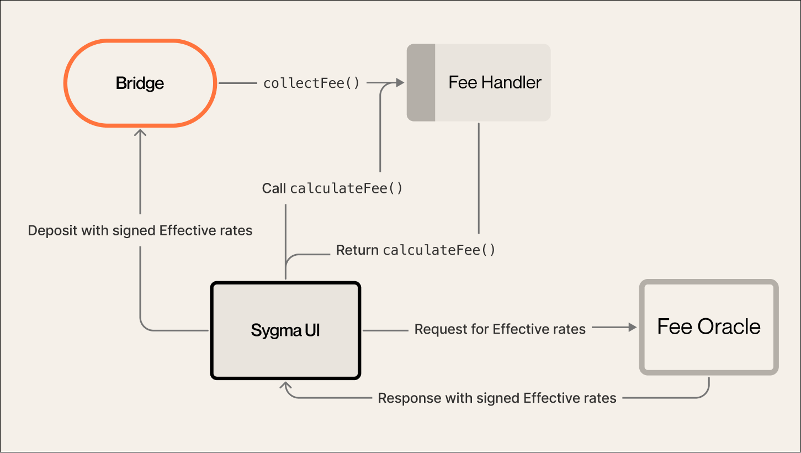

:::info
The following section details how dynamic fee strategies work in Sygma.
:::

This strategy utilizes Sygma's **fee oracle** service, which issues fee estimates based on the current gas price for the destination chain. In addition, the fee oracle can provide price information for different tokens, enabling payment of bridging fees in a non-native currency (e.g. USDC). Each issued gas estimate has a limited time of validity (`expiresAt`) in which it may be executed on.

Check out the [Sygma fee oracle technical documentation](https://github.com/sygmaprotocol/sygma-fee-oracle/blob/main/docs/Home.md) for more details on the service and the format of the issued fee estimates.

The diagram below shows the flow for dynamic fee strategies, beginning with the Sygma SDK, which initiates the interaction for all services:

### Deposit flow

1. Fetch fee estimate
     - Based on `resourceID` and `domainID`, request a fee estimate from the fee oracle service. This fee estimate is valid until `expiresAt`.
2. Validate fee estimate and calculate the final fee
     - Validate the signature on the fee estimate.
     - Get the final fee amount that will be collected on deposit.
3. Execute deposit
     - Provide fee estimate data as an argument when executing the deposit.

--- 

### A Closer Look At Sygma's Fee Oracle

The **fee oracle** provides information about the signed effective rates to the **fee handler**. This rate is used to calculate the transaction fees on the destination network that should be covered by the service fee.&#x20;

Effective rates are the set of information that consists of the gas price of the destination network and the exchange rates of the currency being transferred to the base currency of the destination network.

This information is used to determine the cost of transactions on the destination network, which adjusts the service fees accordingly. If the gas price of the destination network changes dramatically, the fee oracle service allows adaptation of the dynamic fee, providing a fairer service fee for users.&#x20;

:::info
The fee oracle service will be _centralized_ in the beginning.&#x20;

The current architecture implies a future update of the fee oracle to a more decentralized or trustless solution. However, since the calculated fee is visible and approved by the user, the current fee oracle does not pose a [security](/docs/03-architecture/05-security/01-Security-Intro.md) threat to the entire system.
:::
