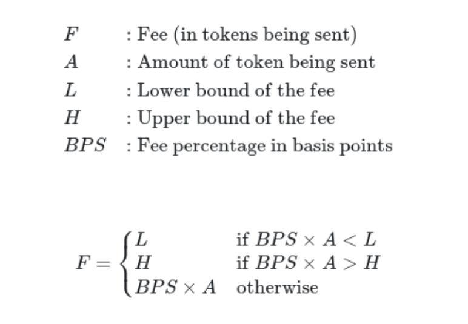
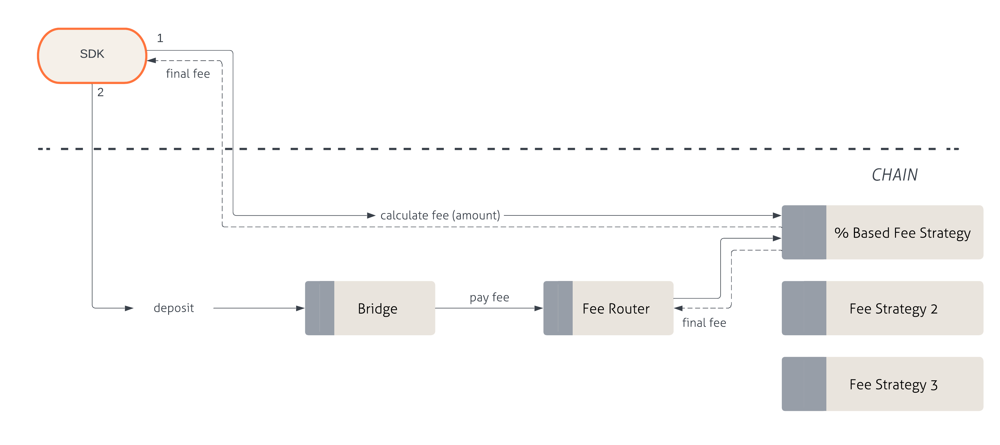

:::info
The following section details how percentage-based fee strategies work in Sygma.
:::

The percentage-based fee strategy calculates a fee amount using basis points (BPS) based on the amount of tokens being transferred. Fees are collected in the token that is being transferred. In this sense, this strategy is only appropriate for fungible token routes. 

To set fees as 1 BPS, the value 100000 would be passed in to account for precision loss on Solidity. Upper and/or lower bounds can also be set. For example, if the calculated fee is less than the lower bound, the lower bound token amount will be charged. If the calculated fee is greater than the upper bound, the upper bound token amount will be charged. If no bounds are set, the BPS value will be charged regardless of the fee calculation amount. 

The diagram below shows the flow for percentage-based fee strategies, beginning with the Sygma SDK, which initiates the interaction for all services:

### Deposit flow

1) Calculate the final fee
   - Based on `resourceID`, `domainID` and amount, request a final fee amount that will be required to execute the deposit.
2) Execute deposit
   - Send the appropriate token amount based on the calculated final fee when executing the deposit.