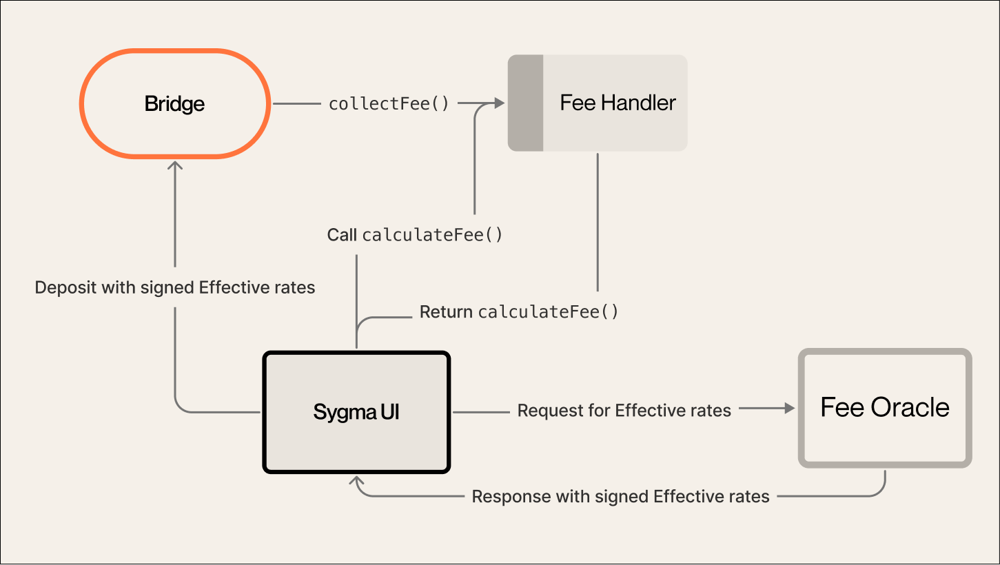

:::info
The following details how fees are handled by Sygma.
:::

#### Fee Oracle

The Fee Oracle is a service that provides signed effective rates information to the Fee Handler. This rate is used to calculate the transaction fees on the destination network that should be covered by the service fee.&#x20;

Effective rates are the set of information that consists of the gas price of the destination network and the exchange rates of the currency being transferred to the base currency of the destination network.

This information is used to determine the cost of transactions on the destination network and adjust the service fees. When the gas price of the destination network changes dramatically, it allows dynamic fee adaptation with a more fair service fee for users.&#x20;

:::info
The Fee Oracle service will be _centralized_ in the beginning.&#x20;

The current architecture implies a future update of the Fee Oracle to a more decentralized or trustless solution. However, since the calculated fee is visible and approved by the user, the current Fee Oracle does not pose a [security](/docs/03-architecture/05-security.md) threat to the entire system.
:::
